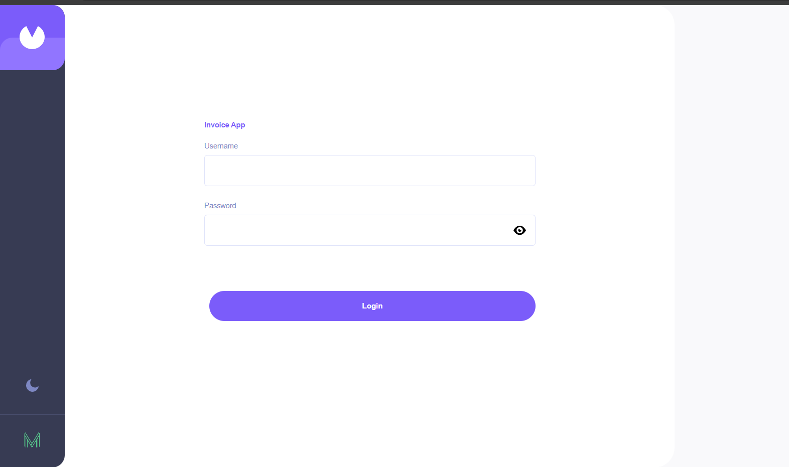

# InvoiceApp

An invoice app . It contains a CRUD based on a backend with NodeJs and a database with Json File on assets.
Check static array of users exsited on assets [You have to use one of them to login with username & password].

✅ Create a new invoice (includes: items, quantities, prices, payment status, payment type).
✅ View invoices.
✅ Update invoices [By Admin Only].
✅ Delete invoice [By Admin Only].
✅ Static data in code with server.js file to change json file.
✅ Dark mode / Light mode.
✅ Responsive design.
✅ Filter invoices according to status [Pending - Draft - Paid].
✅ Using Latest Version of Angular 17.3.0.
✅ Using Standalone components.
✅ Using Reactive Forms.
✅ Using Form Array.
✅ Using Nodejs.
✅ Animations.
✅ Mutliple users.
✅ Authentication & Authorization.

## Running the app

Clone/download the project and run npm install to build the dependencies the project needs.

## Development

1- Run `node server.js` for a backend server. Keep it running on a seperate terminal.

2- Run `ng serve` for a dev server. Navigate to `http://localhost:4200/`. The application will automatically reload if you change any of the source files.

3- You have to login to access app [ You can use one of static users defined on assets/data/users.json file].

## Notes

When you start the project make sure you have the backend running and keep it running.

## Build

Run `ng build` to build the project. The build artifacts will be stored in the `dist/` directory.